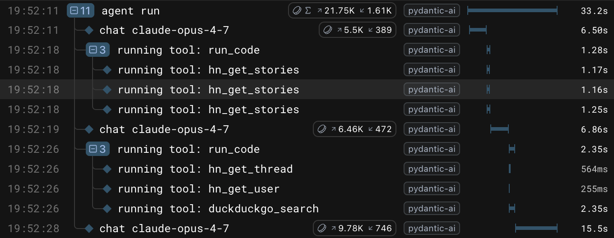

# Pydantic AI Harness

[](https://github.com/pydantic/pydantic-ai-harness/actions/workflows/main.yml?query=branch%3Amain)
[](https://pypi.python.org/pypi/pydantic-ai-harness)
[](https://github.com/pydantic/pydantic-ai-harness)
[](https://github.com/pydantic/pydantic-ai-harness/blob/main/LICENSE)

**The batteries for your [Pydantic AI](https://ai.pydantic.dev/) agent.**

---

An agent is a model in a loop with tools. A *harness* is everything you wrap around that loop to make it useful: the tools, the lifecycle hooks, the instructions, the guardrails, the memory. Pydantic AI gives you the loop and a clean extension point for the rest -- [capabilities](https://ai.pydantic.dev/capabilities/) and [hooks](https://ai.pydantic.dev/hooks/). This package gives you the batteries that plug into it.

**Pydantic AI Harness** is the official capability library for Pydantic AI, maintained by the [Pydantic AI](https://github.com/pydantic/pydantic-ai) team. Core ships the capabilities that need model or framework support and the ones every agent wants -- [web search](https://ai.pydantic.dev/capabilities/#provider-adaptive-tools), [tool search](https://ai.pydantic.dev/deferred-tools/), [thinking](https://ai.pydantic.dev/capabilities/#thinking). Everything else lives here: standalone building blocks you pick and choose to turn your agent into a coding agent, a research assistant, or whatever you are building. As a capability here proves broadly essential, it can graduate into core.

You compose them the same way every time. Import a capability, put it in the `capabilities=[...]` list, run your agent:

```python
from pydantic_ai import Agent
from pydantic_ai_harness import CodeMode, FileSystem

agent = Agent('anthropic:claude-sonnet-4-6', capabilities=[CodeMode(), FileSystem(root_dir='.')])
```

That is the whole model. The rest of this page is which batteries exist and how to reach for them.

**Contents:** [Installation](#installation) · [Quick start](#quick-start) · [What's available today](#whats-available-today) · [Stability tiers](#stability-tiers) · [Roadmap](#roadmap) · [An ecosystem agent](#an-ecosystem-agent) · [Build your own](#build-your-own) · [Keeping the docs honest](#keeping-the-docs-honest) · [Contributing](#contributing) · [Version policy](#version-policy) · [License](#license)

## Installation

```bash
uv add pydantic-ai-harness
```

Some capabilities pull in an extra dependency. Install the extra when you use them:

```bash
uv add "pydantic-ai-harness[code-mode]"   # CodeMode (adds the Monty sandbox)
uv add "pydantic-ai-harness[logfire]"     # ManagedPrompt (Logfire-managed prompts)
uv add "pydantic-ai-harness[acp]"         # ACP (serve an agent to editors over the Agent Client Protocol)
```

> [!NOTE]
> Requires Python 3.10+ and `pydantic-ai-slim>=2.1.0`. The `codemode` extra is an alias for `code-mode`.

## Quick start

Set an API key for whichever model you point at (`ANTHROPIC_API_KEY` for the example below), then:

```bash
uv add "pydantic-ai-slim[anthropic,mcp,duckduckgo,logfire]" "pydantic-ai-harness[code-mode]"
```

```python
import logfire
from pydantic_ai import Agent
from pydantic_ai.capabilities import MCP, WebSearch
from pydantic_ai_harness import CodeMode

# See https://ai.pydantic.dev/logfire/ for setup details.
logfire.configure()
logfire.instrument_pydantic_ai()

agent = Agent(
    'anthropic:claude-opus-4-7',
    capabilities=[
        # Wraps every tool into a single run_code tool, sandboxed by Monty
        # (https://github.com/pydantic/monty -- pulled in by the [code-mode] extra).
        # The model writes Python that calls multiple tools with loops, conditionals,
        # asyncio.gather, and local filtering -- one model round-trip for N tool calls.
        CodeMode(),
        # Connect to any MCP server -- here, the open-source Hacker News server
        # (https://github.com/cyanheads/hn-mcp-server). native=False forces the
        # local MCP toolset so CodeMode can wrap the tools; without it,
        # providers that natively support MCP server connectors execute the tools
        # server-side and bypass the sandbox.
        MCP('https://hn.caseyjhand.com/mcp', native=False),
        # Provider-adaptive web search; native=False routes through the local
        # DuckDuckGo fallback (the [duckduckgo] extra above) so CodeMode can batch
        # web searches alongside the HN calls in a single run_code.
        WebSearch(native=False),
    ],
)

result = agent.run_sync(
    "Across the top, best, and 'show HN' Hacker News feeds, find the most-discussed "
    "story with at least 100 points. Pull its comment thread, its submitter's profile, "
    "and any web coverage. Summarize what you find in one paragraph."
)
print(result.output)
"""
The most-discussed HN story across top/best/show clearing 100 points is "Vibe coding
and agentic engineering are getting closer than I'd like" by Simon Willison (748 points,
853 comments, on the Best feed), submitted by long-time HNer e12e. The piece argues
that the two modes Willison once kept mentally separate -- throwaway "vibe coding" and
disciplined "agentic engineering" -- are blurring, since agents like Claude Code now
reliably handle non-trivial tasks like "build a JSON API endpoint that runs a SQL query"
with tests and docs on the first pass. The HN thread is unusually substantive, with
commenters debating whether LLMs created or merely *exposed* sloppy engineering
practices and warning of a "normalization of deviance" as engineers stop reviewing diffs.
"""
```

[](https://logfire-us.pydantic.dev/public-trace/84bcf123-2106-49da-9f6f-5c26395339bb?spanId=7650806a0785b946)

**[See this run as a public Logfire trace →](https://logfire-us.pydantic.dev/public-trace/84bcf123-2106-49da-9f6f-5c26395339bb?spanId=7650806a0785b946)** Each `run_code` span fans out into the tool calls the model issued from inside the sandbox. It is the easiest way to see what code mode actually did.

## What's available today

Everything in this section is importable from a released version of `pydantic-ai-harness`. Click a capability for its own README with the full API and worked examples.

### Stable

Imported from the top level (`from pydantic_ai_harness import ...`). Covered by the [version policy](#version-policy).

| Capability | Import | What it does |
|---|---|---|
| **[Code mode](pydantic_ai_harness/code_mode/)** | `CodeMode` | Wraps your tools so the model calls them from Python inside a [Monty](https://github.com/pydantic/monty) sandbox. One `run_code` round-trip replaces N tool calls, with loops, conditionals, and `asyncio.gather`. |
| **[File system](pydantic_ai_harness/filesystem/)** | `FileSystem` | Read, write, edit, and search files under a root directory. Resolves symlinks before authorizing, rejects traversal above the root, and protects `.git`, `.env`, and key files by default. |
| **[Shell](pydantic_ai_harness/shell/)** | `Shell` | Run commands in a subprocess rooted at `cwd`, with allowlists, a default denylist for destructive commands, operator blocking, timeouts, and environment masking. |
| **[Managed prompt](pydantic_ai_harness/logfire/)** | `ManagedPrompt` | Back an agent's instructions with a [Logfire](https://pydantic.dev/logfire)-managed prompt, so you can edit and A/B the prompt without shipping code. Needs the `logfire` extra. |

### Experimental

Imported from `pydantic_ai_harness.experimental`. The API can change in any release -- see [Stability tiers](#stability-tiers). Importing one prints a `HarnessExperimentalWarning` telling you how to silence the category.

| Capability | Import from `experimental.` | What it does |
|---|---|---|
| **[Sub-agents](pydantic_ai_harness/experimental/subagents/)** | `subagents.SubAgents` | Give an agent a `delegate_task` tool that runs named sub-agents in fresh, isolated contexts. Loads markdown agent definitions from `./.agents/agents/`. |
| **[Planning](pydantic_ai_harness/experimental/planning/)** | `planning.Planning` | A model-owned `write_plan` tool. The plan is surfaced as an ephemeral tail reminder behind a cache breakpoint, so updating it does not invalidate the prompt cache. |
| **[Compaction](pydantic_ai_harness/experimental/compaction/)** | `compaction.SlidingWindow`, `.SummarizingCompaction`, `.TieredCompaction`, `.LimitWarner`, ... | A family of context-management strategies: zero-cost sliding-window trimming, LLM summarization, tiered escalation to a token target, tool-result clearing, and limit warnings. |
| **[Overflow](pydantic_ai_harness/experimental/overflow/)** | `overflow.OverflowingToolOutput` | Catch oversized tool returns as they are produced and truncate, summarize, or spill them to a store, leaving a `read_tool_result` handle so the model can fetch the full output on demand. |
| **[Repo context](pydantic_ai_harness/experimental/context/)** | `context.RepoContext` | Discover and autoload a repo's coding-assistant context (`CLAUDE.md`, `AGENTS.md`, `.claude/`, `.agents/`), and expose an inventory tool for the rest. |
| **[Step persistence](pydantic_ai_harness/experimental/step_persistence/)** | `step_persistence.StepPersistence` | An append-only step log with continuable snapshots and a tool-effect ledger. `continue_run` resumes a run; `fork_run` branches it. Memory, file, or SQLite stores. |
| **[Docs lookup](pydantic_ai_harness/experimental/docs/)** | `docs.PyaiDocs` | A `read_pyai_docs` tool that returns Pydantic AI documentation on demand, from a local checkout or fetched from the repo. |
| **[Runtime authoring](pydantic_ai_harness/experimental/authoring/)** | `authoring.RuntimeAuthoring` | Let an agent author, validate, and persist real Pydantic AI capabilities at runtime, then load them into its next run. |
| **[ACP](pydantic_ai_harness/experimental/acp/)** | `acp.PydanticAIACPAgent`, `acp.run_acp_stdio` | Serve a Pydantic AI agent to editors (Zed, and other [Agent Client Protocol](https://agentclientprotocol.com) clients) over stdio: streamed text, diff-rendered edits, and tool approval. Needs the `acp` extra. |
| **[Media](pydantic_ai_harness/experimental/media/)** | `media.externalize_media`, `media.S3MediaStore`, ... | Content-addressed stores and helpers that offload large `BinaryContent` out of message history and restore it on demand. Building blocks (used by step persistence), not a capability yet. |

## Stability tiers

The package has two tiers so that new work can ship early without pinning down an API before it has earned it.

- **Stable** capabilities are exported from the top level and covered by the [version policy](#version-policy) below.
- **Experimental** capabilities live under `pydantic_ai_harness.experimental` and may change or be removed in any release, without a deprecation period. This is where most capabilities start; they graduate to stable once the shape settles.

Importing an experimental capability emits a `HarnessExperimentalWarning` once, with the exact line to silence the whole category:

```python
import warnings
from pydantic_ai_harness.experimental import HarnessExperimentalWarning

warnings.filterwarnings('ignore', category=HarnessExperimentalWarning)

from pydantic_ai_harness.experimental.planning import Planning  # no warning now
```

Importing the `experimental` package on its own does not warn, so you can silence first, then import.

## Roadmap

This is the capability work we have not shipped yet. We mapped it by studying leading coding agents, agent frameworks, and assistant products, and each row is tracked as a PR or [issue](https://github.com/pydantic/pydantic-ai-harness/issues) here.

**Vote on whatever is linked in the Status column** -- a PR means we are actively building it, an issue means it is planned. That is how we decide what to build next. For anything already shipped, see [What's available today](#whats-available-today).

| Category | Capability | Description | Status | Community alternatives |
|---|---|---|---|---|
| **Memory** | Memory | Persistent key-value memory across sessions | :construction: [PR&nbsp;#179](https://github.com/pydantic/pydantic-ai-harness/pull/179) | [pydantic-deep](https://github.com/vstorm-co/pydantic-deepagents) (vstorm&#8209;co) |
| **Orchestration** | Skills | Progressive skill loading -- search, activate, deactivate | :construction: [PR&nbsp;#183](https://github.com/pydantic/pydantic-ai-harness/pull/183) | [pydantic-ai-skills](https://github.com/DougTrajano/pydantic-ai-skills) (DougTrajano), [pydantic-deep](https://github.com/vstorm-co/pydantic-deepagents) (vstorm&#8209;co) |
| | Dynamic workflows | Author and run typed multi-agent workflows at runtime | :construction: [PR&nbsp;#273](https://github.com/pydantic/pydantic-ai-harness/pull/273) | |
| | Task tracking | A dedicated todo list with subtasks and dependencies | :memo: [#65](https://github.com/pydantic/pydantic-ai-harness/issues/65) | [pydantic-ai-todo](https://github.com/vstorm-co/pydantic-ai-todo) (vstorm&#8209;co) |
| | Teams | Multi-agent teams with shared state and a message bus | :memo: [#195](https://github.com/pydantic/pydantic-ai-harness/issues/195) | [pydantic-deep](https://github.com/vstorm-co/pydantic-deepagents) (vstorm&#8209;co) |
| **Tools & execution** | Verification loop | Run tests after edits, auto-fix failures | :construction: [PR&nbsp;#169](https://github.com/pydantic/pydantic-ai-harness/pull/169) | |
| **Safety & guardrails** | Guardrails | Validate input and output, cap cost/tokens, gate tool access, run validation async | :construction: [PR&nbsp;#182](https://github.com/pydantic/pydantic-ai-harness/pull/182) | [pydantic-ai-shields](https://github.com/vstorm-co/pydantic-ai-shields) (vstorm&#8209;co) |
| | Secret masking | Detect and redact secrets in agent I/O | :construction: [PR&nbsp;#172](https://github.com/pydantic/pydantic-ai-harness/pull/172) | [pydantic-ai-shields](https://github.com/vstorm-co/pydantic-ai-shields) (vstorm&#8209;co) |
| | Approval workflows | Require human approval for sensitive operations | :construction: [PR&nbsp;#173](https://github.com/pydantic/pydantic-ai-harness/pull/173) | [Pydantic&nbsp;AI](https://ai.pydantic.dev/deferred-tools/#human-in-the-loop-tool-approval) (built&#8209;in) |
| | Tool budget | Limit total tool calls or cost per run | :construction: [PR&nbsp;#168](https://github.com/pydantic/pydantic-ai-harness/pull/168) | |
| **Reliability** | Stuck loop detection | Detect and break out of repetitive agent loops | :construction: [PR&nbsp;#186](https://github.com/pydantic/pydantic-ai-harness/pull/186) | |
| | Tool error recovery | Retry failed tool calls with backoff and budget | :construction: [PR&nbsp;#171](https://github.com/pydantic/pydantic-ai-harness/pull/171) | |
| | Tool orphan repair | Fix orphaned tool calls in conversation history | :construction: [PR&nbsp;#184](https://github.com/pydantic/pydantic-ai-harness/pull/184) | |
| **Context** | System reminders | Inject periodic reminders to counteract instruction drift | :construction: [PR&nbsp;#181](https://github.com/pydantic/pydantic-ai-harness/pull/181) | |
| **Reasoning** | Adaptive reasoning | Adjust thinking effort to task complexity | :construction: [PR&nbsp;#174](https://github.com/pydantic/pydantic-ai-harness/pull/174) | |
| | Current time | Inject the current date and time into the system prompt | :construction: [PR&nbsp;#170](https://github.com/pydantic/pydantic-ai-harness/pull/170) | |

> Packages by [vstorm-co](https://github.com/vstorm-co) are endorsed by the Pydantic AI team. We are working with them to upstream some of their implementations into this repo.

Want something that is not here? [Open a capability request](https://github.com/pydantic/pydantic-ai-harness/issues/new?template=capability-request.yml).

## An ecosystem agent

The Quick start is deliberately small. Here is the other end of the spectrum: an agent wired up with capabilities from across the Pydantic AI ecosystem -- this repo, core `pydantic-ai`, and community packages. Where the harness now ships a first-party capability, the import comment points at it.

```python
import logfire
from pydantic_ai import Agent
from pydantic_ai.capabilities import MCP, Thinking, ToolSearch, WebSearch
from pydantic_ai_harness import CodeMode, FileSystem, Shell
from pydantic_ai_harness.experimental.compaction import SummarizingCompaction
from pydantic_ai_harness.experimental.planning import Planning
from pydantic_ai_harness.experimental.subagents import SubAgent, SubAgents

# Community packages, for capabilities the harness has not shipped yet:
from pydantic_ai_shields import CostTracking, InputGuard, SecretRedaction, ToolGuard
from pydantic_deep import MemoryCapability, StuckLoopDetection

# See https://ai.pydantic.dev/logfire/ for setup details.
logfire.configure()
logfire.instrument_pydantic_ai()

# A sub-agent is just an Agent with a name and description; the parent delegates to it by name.
researcher = Agent(
    'anthropic:claude-sonnet-4-6',
    name='researcher',
    description='Deep research on a topic',
    instructions='You are a thorough research assistant.',
)

agent = Agent(
    'anthropic:claude-opus-4-7',
    capabilities=[
        # --- Tool execution & discovery ---
        # Wraps every tool into a single run_code, sandboxed by Monty.
        CodeMode(),
        # Progressive tool discovery for large tool sets; discovered tools fold into run_code.
        ToolSearch(),

        # --- Reasoning ---
        # Provider-adaptive thinking; uses native extended thinking on supporting models.
        Thinking(effort='xhigh'),

        # --- Context management ---
        # First-party LLM compaction. Core also ships AnthropicCompaction / OpenAICompaction
        # for provider-native compaction.
        SummarizingCompaction(max_tokens=180_000),

        # --- Tools ---
        # Connect to any MCP server -- here, the open-source Hacker News server.
        MCP('https://hn.caseyjhand.com/mcp'),
        # Provider-adaptive web search; falls back to a local DuckDuckGo implementation.
        WebSearch(),
        # First-party filesystem + shell, scoped to the working directory.
        FileSystem(root_dir='.'),
        Shell(cwd='.'),

        # --- Planning & orchestration ---
        # Model-owned plan that does not invalidate the prompt cache.
        Planning(),
        # Delegate self-contained subtasks to named sub-agents in isolated contexts.
        SubAgents(agents=[SubAgent(researcher)]),

        # --- Not yet first-party: community packages ---
        # Persistent ./MEMORY.md per agent name. By @vstorm-co: https://github.com/vstorm-co/pydantic-deepagents
        MemoryCapability(agent_name='harness-example'),
        # Per-run cost cap. By @vstorm-co: https://github.com/vstorm-co/pydantic-ai-shields
        CostTracking(budget_usd=5.0),
        # Reject prompt-injection-looking input.
        InputGuard(guard=lambda p: 'ignore previous instructions' not in p.lower()),
        # Block or require approval per tool name.
        ToolGuard(blocked=['rm'], require_approval=['write_file']),
        # Redact API keys/tokens in tool I/O before they reach the model.
        SecretRedaction(),
        # Bail out if the agent loops on the same tools.
        StuckLoopDetection(),
    ],
)
```

This snippet is illustrative, not copy-pasteable: a few capabilities have setup requirements, and the community packages move independently of this one. As the harness ships first-party versions, the community imports collapse onto the harness ones. The [Roadmap](#roadmap) tracks which are which.

## Build your own

[Capabilities](https://ai.pydantic.dev/capabilities/#building-custom-capabilities) are the primary extension point for Pydantic AI, and every capability in this repo is a worked example you can read. [`code_mode`](pydantic_ai_harness/code_mode/) is the canonical one for shape, docs, tests, and public exports.

**Publishing as a standalone package?** Use the `pydantic-ai-<name>` naming convention. See [Publishing capability packages](https://ai.pydantic.dev/extensibility/#publishing-capability-packages).

## Keeping the docs honest

This README is meant to track what actually ships, not what we hope ships. Two things keep it honest:

- **A parity check in CI.** [`tests/test_docs_parity.py`](tests/test_docs_parity.py) fails the build if a capability package has no `README.md`, or if a capability package is not linked from this README. A new capability cannot land without showing up here.
- **A reviewer that reads the diff.** The [docs-parity reviewer](https://github.com/pydantic/pydantic-ai-harness/pull/329) checks that per-capability READMEs and the elevated docs pages describe the code as written, catching drift the mechanical check cannot see.

If you add or rename a capability and CI complains here, that is working as intended: add the README, link it from the tables above, and the check goes green.

## Contributing

We welcome capability contributions. Here is how:

1. **Start with an issue.** [Open a capability request](https://github.com/pydantic/pydantic-ai-harness/issues/new?template=capability-request.yml) describing the behavior you want. This lets us discuss the approach and priority before code is written.
2. **Then open a PR.** Once the issue exists, open a PR with an implementation and link the issue. We review based on community interest -- upvotes on both the issue and PR count.
3. **Don't chase green CI.** Get the approach working, then let us know. We may push to your branch, rewrite, or open a follow-up PR. You will be credited as the original author. (See the [Pydantic AI contributing guide](https://github.com/pydantic/pydantic-ai/blob/main/CONTRIBUTING.md).)

New capabilities start under `pydantic_ai_harness.experimental`. Start from the [`code_mode`](pydantic_ai_harness/code_mode/) package shape and delete what you do not need.

> [!NOTE]
> PRs from non-team members that modify `pyproject.toml` or `uv.lock` are auto-closed by CI to prevent supply-chain risk. If you need a new dependency, [open an issue](https://github.com/pydantic/pydantic-ai-harness/issues/new).

### Development

```bash
make install   # install dependencies
make format    # ruff format
make lint      # ruff check
make typecheck # pyright strict
make test      # pytest
make testcov   # pytest with 100% branch coverage
```

## Version policy

Pydantic AI Harness uses **0.x versioning** to signal that APIs are still stabilizing. During 0.x:

- **Minor releases** (0.1 → 0.2) may include breaking changes to stable capabilities -- renamed parameters, changed defaults, restructured APIs. As capabilities gain provider-native support (starting as a local implementation, then switching to the provider's built-in API when available), we may need to reshape APIs we could not fully anticipate.
- **Patch releases** (0.1.0 → 0.1.1) will not intentionally break existing behavior.
- **Experimental capabilities** (`pydantic_ai_harness.experimental`) are exempt from the above and may change in any release.
- **All breaking changes** are documented in release notes with migration guidance. Where practical, we keep the previous behavior available under a deprecated name before removing it.

This is why Pydantic AI Harness is a separate package from [Pydantic AI](https://github.com/pydantic/pydantic-ai), which has a [stricter version policy](https://ai.pydantic.dev/version-policy/). As the core capabilities stabilize, we will move toward 1.0 with matching guarantees.

## Pydantic AI references

- [Capabilities](https://ai.pydantic.dev/capabilities/) -- what capabilities are, built-in capabilities, building your own
- [Hooks](https://ai.pydantic.dev/hooks/) -- lifecycle hooks reference, ordering, error handling
- [Extensibility](https://ai.pydantic.dev/extensibility/) -- publishing packages, third-party ecosystem
- [Toolsets](https://ai.pydantic.dev/toolsets/) -- building tools for capabilities
- [API reference](https://ai.pydantic.dev/api/capabilities/) -- full API docs

## Part of the Pydantic Stack

The Pydantic Stack is everything you need to ship production-grade AI agents:

- [Pydantic AI](https://pydantic.dev/pydantic-ai?utm_source=github&utm_medium=readme&utm_campaign=pydantic-ai-harness) - Type-safe agent framework
- [Pydantic Logfire](https://pydantic.dev/logfire?utm_source=github&utm_medium=readme&utm_campaign=pydantic-ai-harness) - AI-first, full-stack observability
- [Logfire AI Gateway](https://pydantic.dev/ai-gateway?utm_source=github&utm_medium=readme&utm_campaign=pydantic-ai-harness) - Unified LLM proxy

## License

MIT -- see [LICENSE](LICENSE).
